<!-- README-driven: the PUBLIC PROMISE. Build to it. Order: build → test → observe.
     Tables over prose. Do NOT reference any gitignored path from this file. -->

# azure-runbook-azFw-checkAccessControl

> A PowerShell Azure Automation runbook that answers one question fast:
> **"Is this flow allowed by this Azure Firewall Policy?"** — checking the policy's **DNAT**, **network**,
> and **application** rule collections and returning a provenance-backed `ALLOWED` / `ACCESS DENIED` verdict.

**Status:** ✅ deployed via Terraform (~$0/mo, no firewall) · runbook published · **behaviour proven on live Azure**.

---

## Business problem

**Who hurts:** firewall admins, app teams raising connectivity tickets, and on-call engineers mid-incident —
anyone who needs a fast, reliable answer to *"is this specific flow already allowed by the firewall policy?"*

**The pain today:** confirming whether a policy permits a flow means manually hunting through rules across
**three** different collection types — **DNAT, network, and application** — in the portal. It's slow,
easy to miss a match, and gives no scriptable answer. Where the same rules must be maintained across
**multiple firewall policies**, that uncertainty multiplies — policies get re-applied without a quick way
to verify, beforehand, whether a given policy already has the rule.

**Why it matters:** a scriptable, run-it-first check ends the manual scrolling, prevents missed matches, and
returns a provenance-backed verdict (the exact rule that allows it) in seconds — usable by a human or piped
into other automation.

---

## What it does

You give it a target policy (**subscription / resource group / firewall policy name**) and a **flow**
(**source IP, destination IP or FQDN, protocol, destination port**). It evaluates the flow against all rule
collection groups in Azure's own order — **DNAT → network → application** — and tells you whether an allow
rule exists, **which** one, or that the flow falls to the firewall's implicit deny.

It is **read-only** (never modifies rules) and **keyless** (runs as the Automation account's managed identity).

### Verdicts

| Verdict | Meaning |
|---|---|
| `ALLOWED` | An allow rule matches — output names the **policy → rule collection group → rule collection → rule**. |
| `ACCESS DENIED (implicit)` | No allow rule matches → Azure Firewall's default deny. |
| `DENIED (explicit)` | A `Deny` rule matches (defensive; current policies are allow-only). |

### Matching rules

| Field | You enter | Matched against | How |
|---|---|---|---|
| Source | host IP | IP / CIDR / **IP Group** | IP-in-CIDR **containment** (IP Groups resolved to prefixes) |
| Dest (DNAT/network) | host IP | IP / CIDR / IP Group | containment |
| Dest (application) | URL / FQDN | wildcard FQDN | deterministic wildcard match (no DNS) |
| Port | single port | port / range / list | port-in-range **containment** |
| Protocol | TCP/UDP/ICMP or HTTP/HTTPS/MSSQL | same / `Any` | equality |

**Out of scope (v1):** write operations, checking one flow against multiple policies in a single run,
routing/UDR/NSG/reachability, Service-Tag evaluation (reported as *"not checked"*), DNS resolution, and
IPv6 (returns *"unsupported in v1"*).

---

## How it works

```
 input (sub/RG/policy + flow)
        │
        ▼
 [validate] ──► IPv6 / malformed / empty ──► clean error, non-zero exit
        │
        ▼
 Connect-AzAccount -Identity (SAMI) ──► Get-AzFirewallPolicy ──► enumerate ALL collection groups
        │
        ▼
 ┌──────────────┬──────────────┬──────────────────┐
 │ DNAT matcher │ Net matcher  │ App matcher      │   (Azure eval order)
 │ pre-NAT dest │ CIDR + IPGrp │ wildcard FQDN    │
 │ + port/proto │ + port/proto │ + proto          │
 └──────┬───────┴──────┬───────┴────────┬─────────┘
        ▼              ▼                 ▼
            verdict resolver ──► ALLOWED (policy→group→collection→rule)
                              ──► ACCESS DENIED (implicit) / DENIED (explicit)
                                   │
                                   ▼
                     human-readable log + JSON + scriptable exit code
```

---

## Build

```text
1. Import the runbook (PowerShell) into the dev Azure Automation account.
2. Ensure the Az modules (Az.Accounts, Az.Network) are present at a pinned version.
3. Enable the account's system-assigned managed identity (SAMI).
4. Grant the SAMI the built-in Reader role on the firewall policy's resource group
   (and any RG holding referenced IP Groups).
```

*Infrastructure (resource group, firewall policy + seed rules, IP groups, automation account, runbook,
Reader role) is provisioned with Terraform — modular, ~$0/mo, no Azure Firewall created.*

**Configure & deploy:**

```bash
cd infra
cp infra.auto.tfvars.example infra.auto.tfvars   # then fill in your subscription_id / tenant_id
terraform init
terraform apply
```

> `infra.auto.tfvars` is **gitignored** — it holds your real subscription/tenant IDs and is never
> committed. Variable *declarations* live in `variables.tf` (public); the *values* stay local in your tfvars.

---

## Test

The PRD success metrics are the acceptance criteria — each proven by a captured run:

| # | Scenario | Expected |
|---|---|---|
| 1–3 | Flow present in a network / DNAT / application rule | `ALLOWED` + provenance |
| 4 | Flow absent everywhere | `ACCESS DENIED (implicit)` |
| 5 | Host IP inside a CIDR (`10.20.5.7` ∈ `10.20.0.0/16`) | `ALLOWED` (containment) |
| 6 | Host IP inside an IP Group member prefix | `ALLOWED` |
| 7 | Port in range (`8080` ∈ `8000-8100`) / out of range | `ALLOWED` / not matched |
| 8 | FQDN matches wildcard (`api.azure.com` ∈ `*.azure.com`) | `ALLOWED` |
| 9 | Rule uses a Service Tag | reported *"not checked"* |
| 10 | JSON output parses + exit code scriptable | structured + correct code |
| 11 | IPv6 input | clean *"unsupported in v1"* message |
| 12 | Malformed IP / empty field | clean validation error + non-zero exit |

Repeatable test commands live in [`tests/firewall-check-tests.sh`](tests/firewall-check-tests.sh) and
[`tests/firewall-check-tests.ps1`](tests/firewall-check-tests.ps1) (bash + PowerShell runners).

### Proof it works

Live runs on real Azure, in Azure's own evaluation order — **DNAT → Network → Application**. Each returns a
verdict with provenance and parseable JSON; rules the tool can't IP-match (FQDN/Service-Tag) are surfaced as
honest report-only notes.

#### DNAT

**Pre-NAT match → `ALLOWED`** (`203.0.113.9 → 20.50.60.71 : TCP/8443` = the original port, matched `dnat-https`):

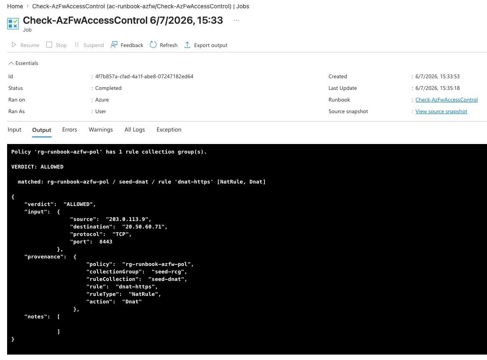

**Negative case → `ACCESS DENIED`** (same destination but port `443` is the *translated* port; DNAT matches the **pre-NAT** port `8443`, so no match → implicit deny):

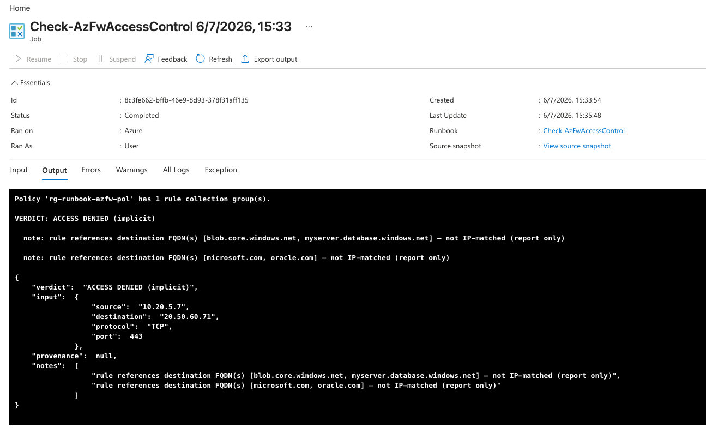

#### Network

**CIDR containment → `ALLOWED`** (`10.20.1.8 → 10.30.5.5 : TCP/443` matched `allow-web-cidr`):

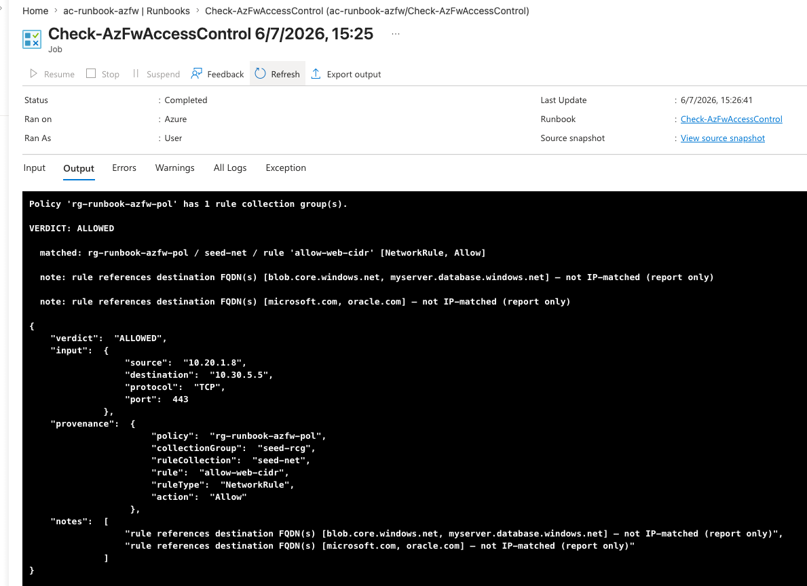

**IP Group → `ALLOWED`** (`10.50.7.7 ∈ ipg-onprem` matched `allow-onprem-ipgroup`) — the output shows
`dest via: IP group 'ipg-onprem' (member 10.50.0.0/16)`, so you see *how* it matched:

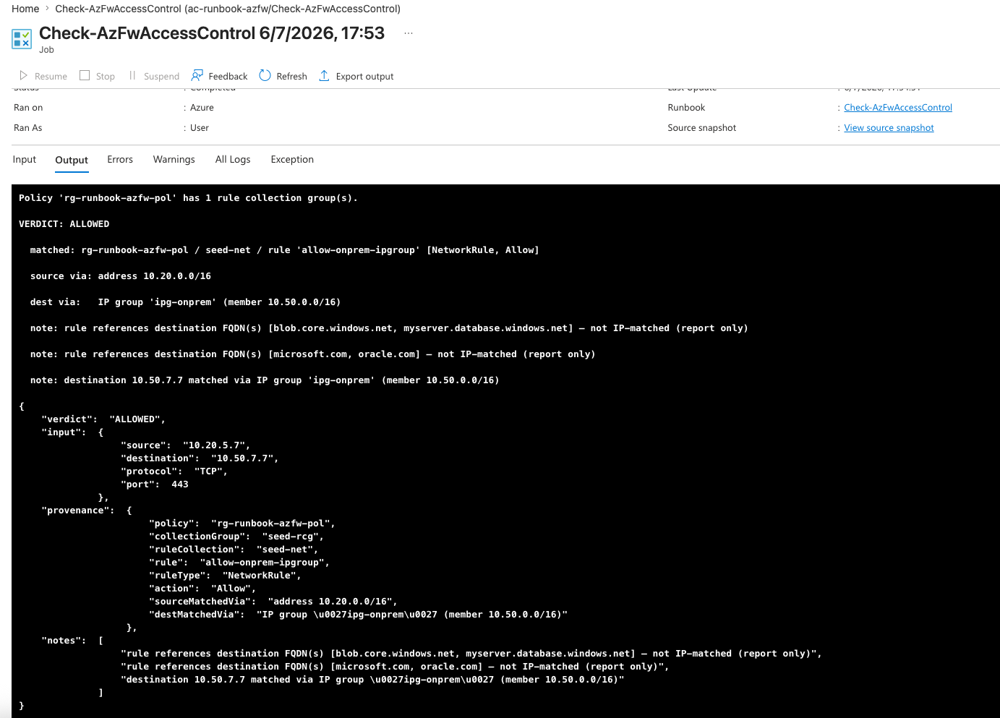

#### Application

**Wildcard FQDN → `ALLOWED`** (`api.azure.com ∈ *.azure.com` matched `allow-azure-wild`):

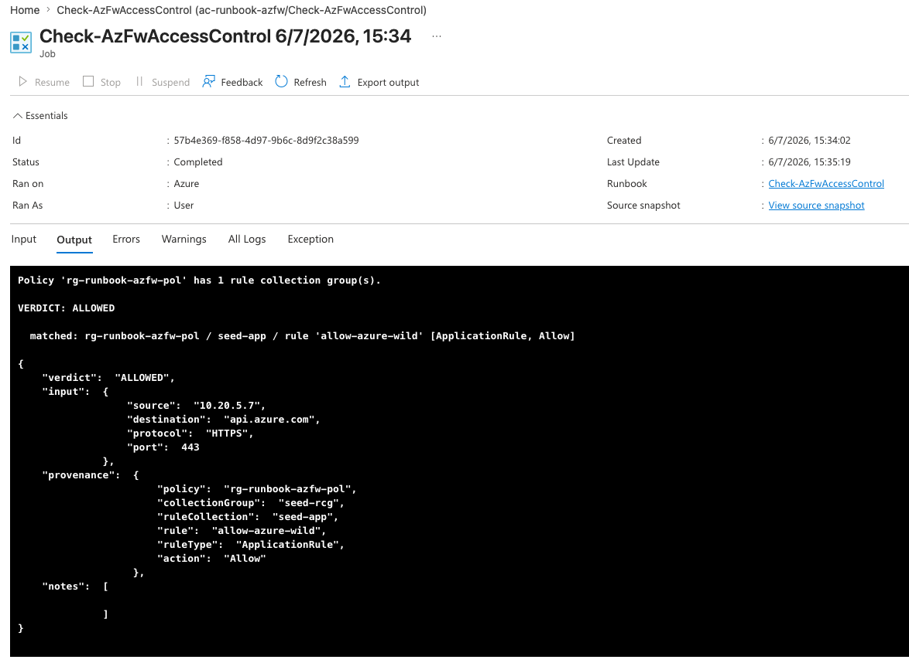

**Source IP Group → `ALLOWED`** (source `10.60.1.9 ∈ ipg-appclients` matched `allow-appclients-ipgroup`) —
the output shows `source via: IP group 'ipg-appclients' (member 10.60.0.0/16)`:

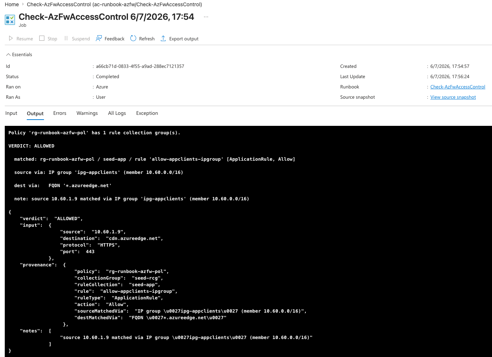

---

## Observe / run

```text
# Manual run from the dev Automation account → Start, with parameters:
#   SourceIp, Destination (IP or FQDN), Protocol, DestinationPort
#   (Subscription / ResourceGroup / FirewallPolicyName are defaulted)
# See demo.md for the exact reproducible run + expected output.
```

### Webhook (optional)

A webhook-triggered variant — `runbooks/Check-AzFwAccessControl-Webhook.ps1` — reads the flow from an HTTP
POST body. It's deployed when `create_webhook = true` (default). The webhook URL is a **sensitive** Terraform
output (shown once, on first apply — treat it as a credential):

```bash
terraform -chdir=infra output -raw webhook_uri   # the secret URL
curl -X POST "<webhook_uri>" -H 'Content-Type: application/json' \
  -d '{"SourceIp":"10.20.5.7","Destination":"10.30.1.4","Protocol":"TCP","Port":443}'
# → HTTP 202 + JobId (fire-and-forget; read the verdict from the job output)
```

For a *synchronous* answer, poll the job output (see `tests/firewall-check-tests.*`) or front the same logic
with an HTTP-triggered Azure Function. Dedicated webhook runners live in
[`tests/webhook-check-tests.sh`](tests/webhook-check-tests.sh) and
[`tests/webhook-check-tests.ps1`](tests/webhook-check-tests.ps1).

#### Webhook — proven across collections

Every check below was triggered by an HTTP **POST to the webhook URL** (runbook `Check-AzFwAccessControl-Webhook`),
in Azure's order — **DNAT → Network → Application** — plus an implicit-deny case:

**DNAT → `ALLOWED`** (`20.50.60.70 : TCP/3389` matched `dnat-rdp`):

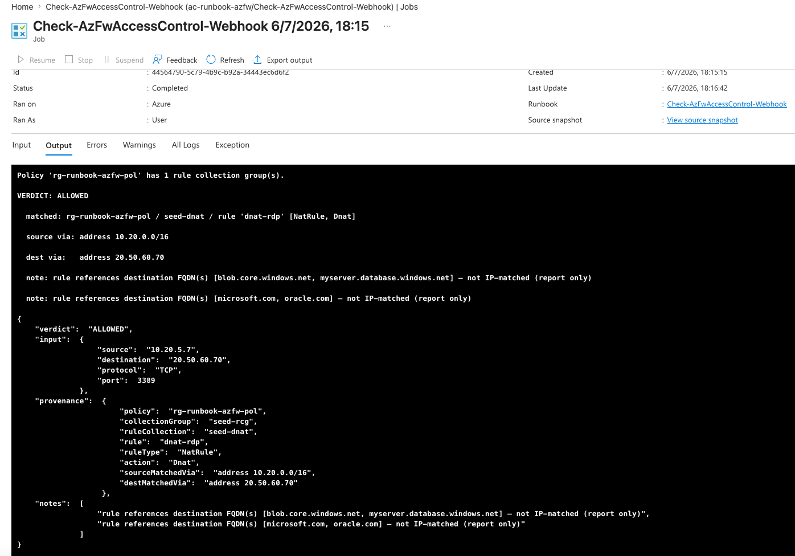

**Network CIDR → `ALLOWED`** (`10.30.1.4 : TCP/443` matched `allow-web-cidr`):

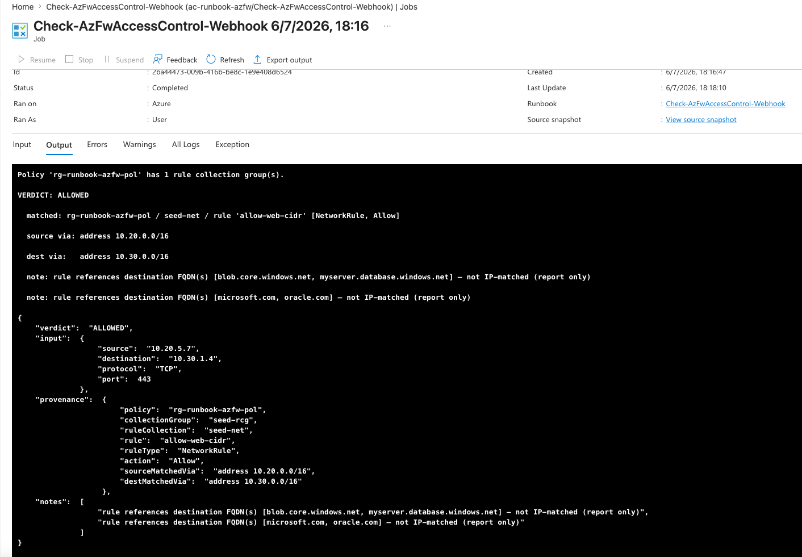

**Network IP Group → `ALLOWED`** (`10.50.7.7 ∈ ipg-onprem` matched `allow-onprem-ipgroup`; `dest via` shown):

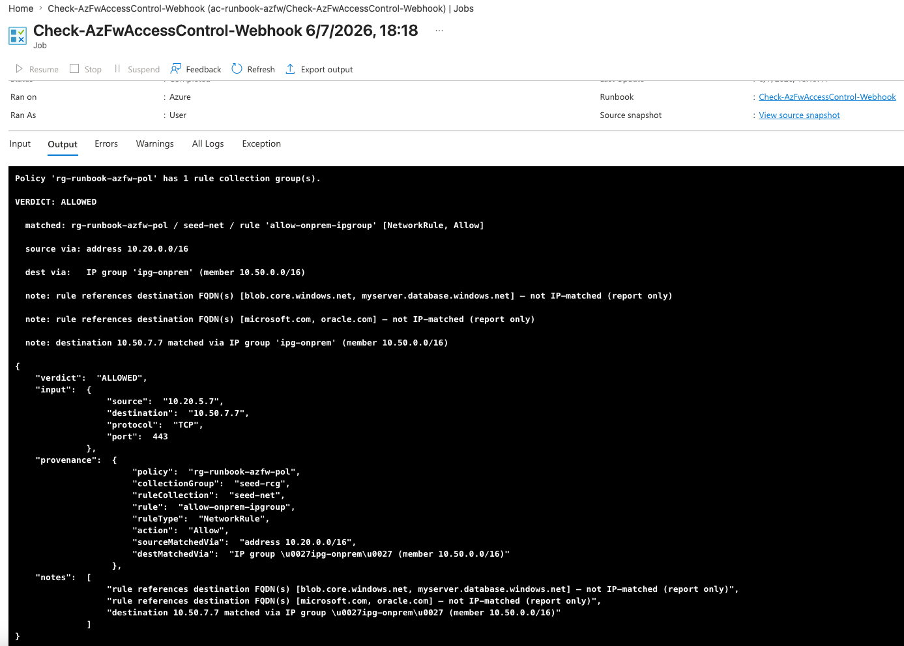

**Application wildcard → `ALLOWED`** (`api.azure.com ∈ *.azure.com` matched `allow-azure-wild`):

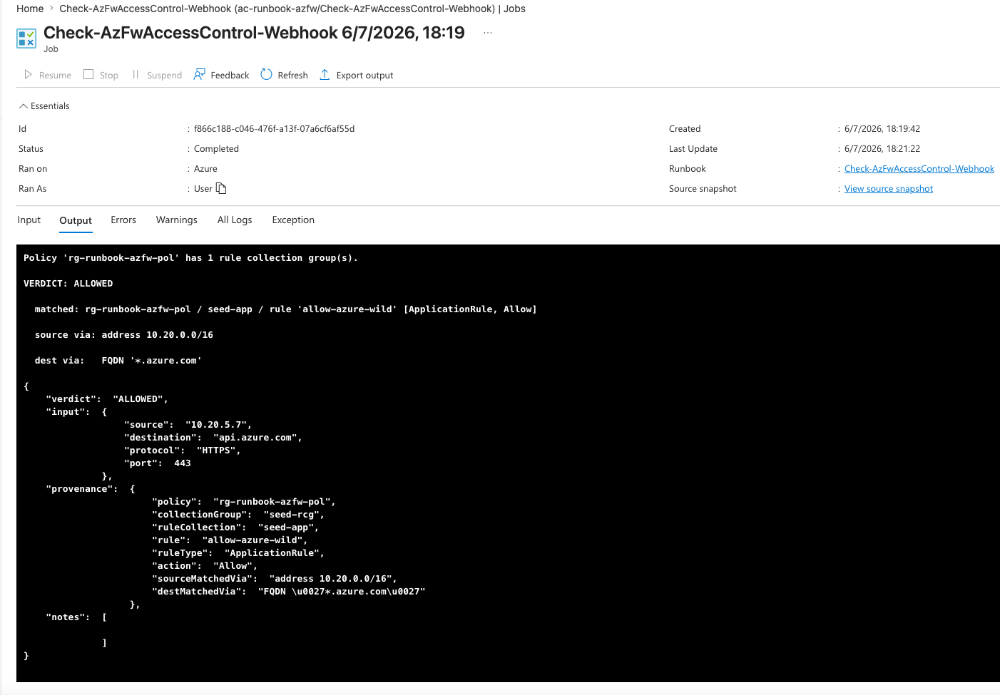

**No match → `ACCESS DENIED (implicit)`** (`10.99.0.1 → 10.30.1.4` — source not in any rule):

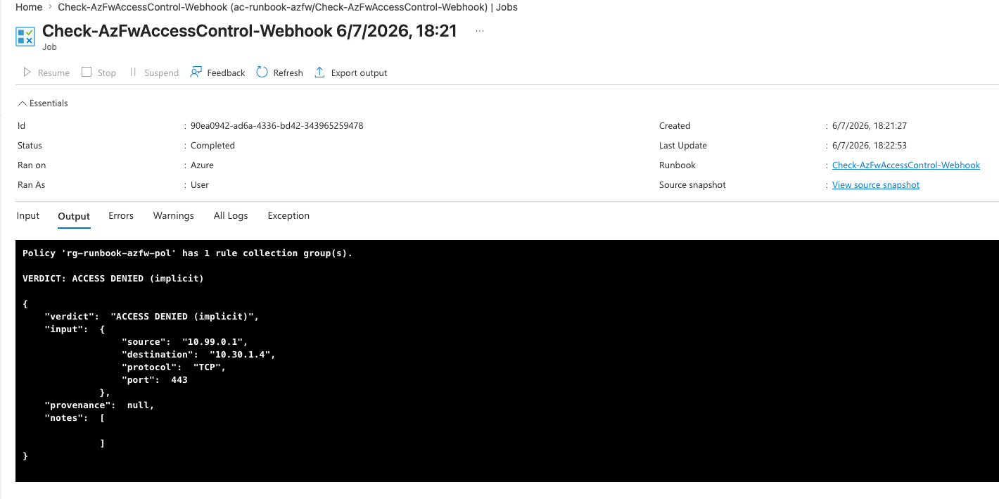

---

## License

[MIT](LICENSE) © 2026 Rajendra Pal
